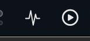

> **Medical Disclaimer:** DexBar is an unofficial, personal convenience tool and is **not a medical device**. It is not intended to be used for medical decisions, treatment, or diagnosis. Always use your official Dexcom receiver, app, or other clinically approved methods to verify your blood glucose before making any medical decisions. Do not rely solely on this app.

# DexBar

A native menu bar / system tray app that displays real-time blood glucose readings from your Dexcom CGM via the Dexcom Share API. Available for **macOS** and **Linux**.


## Features

- **Live readings** — displays your current blood sugar value and trend arrow in the menu bar (e.g. `94 →`)
- **Auto-refresh** — polls Dexcom every 5 minutes, timed to the actual reading timestamp so refreshes stay aligned even after manual refreshes
- **mg/dL or mmol/L** — toggle units in Settings
- **Configurable alerts** — macOS notifications for:
  - High blood sugar (above a threshold you set)
  - Low blood sugar (below a threshold you set)
  - Rising fast (↑ ⇈)
  - Dropping fast (↓ ⇊)
- **Alert cooldowns** — same-type alerts won't repeat within 15 minutes
- **Secure credential storage** — username and password stored in macOS Keychain
- **Auto-connect on launch** — reconnects automatically using saved credentials
- **Region support** — US, Outside US, and Japan Dexcom Share endpoints

## Requirements

- macOS 14 Sonoma or later
- A Dexcom account with [Share enabled](https://provider.dexcom.com/education-research/cgm-education-use/videos/setting-dexcom-share-and-follow) and at least one follower set up
- Xcode 15+ (to build from source)

## Getting Started

### Download (easiest)

**One-line install** — paste this in Terminal. No quarantine warnings, no Gatekeeper prompts:

```bash
curl -sL https://raw.githubusercontent.com/SucculentGoose/dexbar/main/install.sh | bash
```

The script downloads the latest release directly via `curl` (bypassing macOS quarantine), installs to `/Applications`, and launches the app.

<details>
<summary>Manual install instead</summary>

1. Go to the [Releases](../../releases) page and download the latest `DexBar-vX.X.X.zip`
2. Unzip and drag **DexBar.app** to your `/Applications` folder
3. **Bypass Gatekeeper:** Because DexBar is not notarized, macOS will show a *"damaged and can't be opened"* warning. Run this once in Terminal:
   ```bash
   xattr -cr /Applications/DexBar.app
   ```
4. Open DexBar from `/Applications` normally

</details>

### Build from source

1. Clone the repo:
   ```bash
   git clone https://github.com/your-username/dexbar.git
   cd dexbar
   ```

2. Generate the Xcode project (requires [xcodegen](https://github.com/yonaskolb/XcodeGen)):
   ```bash
   brew install xcodegen
   xcodegen generate
   ```

3. Open the project in Xcode:
   ```bash
   open DexBar.xcodeproj
   ```

4. Select your Team under **Signing & Capabilities**, then build and run (`⌘R`).

### First-time setup

1. Click the  icon in your menu bar
2. Click **Settings…**
3. Enter your Dexcom username, password, and region
4. Click **Connect**

Your credentials are saved to the macOS Keychain. From this point on, DexBar will connect automatically every time it launches.

## Settings

| Setting | Description |
|---|---|
| Username / Password | Your Dexcom Share account credentials |
| Region | US / Outside US / Japan |
| Units | mg/dL or mmol/L |
| Refresh interval | 1, 2, 5, 10, or 15 minutes |
| High alert threshold | Notify when BG exceeds this value |
| Low alert threshold | Notify when BG falls below this value |
| Rising fast alert | Notify on SingleUp or DoubleUp trend |
| Dropping fast alert | Notify on SingleDown or DoubleDown trend |

## How it works

DexBar uses the **Dexcom Share API** — the same service used by Dexcom's follower app. It requires your (or the patient's) Dexcom credentials, not a follower's credentials.

API endpoints used:
- `POST /General/AuthenticatePublisherAccount` — authenticates and returns an account ID
- `POST /General/LoginPublisherAccountById` — exchanges account ID + password for a session token
- `GET /Publisher/ReadPublisherLatestGlucoseValues` — fetches the latest glucose reading

> **Note:** Dexcom Stelo is not compatible with the Share service and is not supported.

## Project structure

```
dexbar/
├── Sources/
│   └── DexBarCore/                   # Shared library (macOS + Linux)
│       ├── Models/
│       │   └── GlucoseReading.swift  # Data model, trend enum, unit conversion
│       ├── Services/
│       │   └── DexcomService.swift   # Dexcom Share API client (async/await)
│       └── Shared/
│           └── CoreTypes.swift       # MonitorState, TiRStats, TimeRange enums
├── DexBar/                           # macOS app
│   └── Sources/
│       ├── DexBarApp.swift           # App entry point, MenuBarExtra
│       ├── Services/
│       │   └── KeychainService.swift # Secure credential storage (Keychain)
│       ├── Managers/
│       │   ├── GlucoseMonitor.swift  # Polling loop, alert evaluation
│       │   └── NotificationManager.swift  # macOS notification delivery
│       └── Views/
│           ├── MenuBarView.swift     # Popover UI
│           ├── SettingsView.swift    # Settings window
│           └── GlucoseChartView.swift
└── DexBarLinux/                      # Linux app
    └── Sources/
        ├── main.swift                # Entry point (GTK3 main loop)
        ├── Managers/
        │   ├── GlucoseMonitorLinux.swift  # Polling loop, alert evaluation
        │   └── LinuxNotificationManager.swift  # libnotify notifications
        ├── Services/
        │   └── SecretServiceStorage.swift  # KDE Wallet / GNOME Keyring
        └── Views/
            ├── TrayIcon.swift        # libayatana-appindicator3 tray icon
            ├── PopupWindow.swift     # GTK3 status popup
            ├── SettingsWindow.swift  # GTK3 settings window
            └── AutoStart.swift      # ~/.config/autostart/ management
```

---

## Linux

DexBar also runs on Linux as a system tray application. It is tested on **KDE Plasma 6** but works on any desktop environment that supports the StatusNotifierItem protocol (GNOME with AppIndicator extension, XFCE, etc.).

### Linux Requirements

- Swift 6.0+ — [swift.org/download](https://swift.org/download)
- GTK3: `libgtk-3-dev`
- System tray: `libayatana-appindicator3-dev`
- Credential storage: `libsecret-1-dev`
- Desktop notifications: `libnotify-dev`

### Linux Installation

```bash
# 1. Install system dependencies (Debian/Ubuntu/KDE Neon)
sudo apt install libgtk-3-dev libayatana-appindicator3-dev libsecret-1-dev libnotify-dev

# 2. Clone and build
git clone https://github.com/SucculentGoose/dexbar
cd dexbar
swift build -c release --product DexBarLinux

# 3. Install (user-local, no sudo needed)
mkdir -p ~/.local/bin
cp .build/release/DexBarLinux ~/.local/bin/dexbar
```

Or use the install script which does all of the above:

```bash
curl -fsSL https://raw.githubusercontent.com/SucculentGoose/dexbar/main/install.sh | bash
```

### Linux First Run

```bash
dexbar &
```

A tray icon appears in your system tray. Click it to open the menu, then choose **Show Status** to open the glucose popup or **Open Settings** to configure the app. In Settings → **Account**, enter your Dexcom credentials, choose your region, and click **Connect**.

Credentials are stored securely in KDE Wallet (or GNOME Keyring) via the Secret Service D-Bus API. On first run KDE Wallet may prompt you to create a wallet or unlock an existing one.

### Linux Features

- **Status popup** — macOS-style popup with a live glucose chart (3h/6h/12h/24h), Time in Range bar (2d–90d), GMI, and real-time countdown to the next reading
- **Auto-update** — checks for updates on launch and daily; one-click install from the tray menu
- **Credential storage** — passwords stored securely via the Secret Service D-Bus API (KDE Wallet / GNOME Keyring)


## License

MIT
